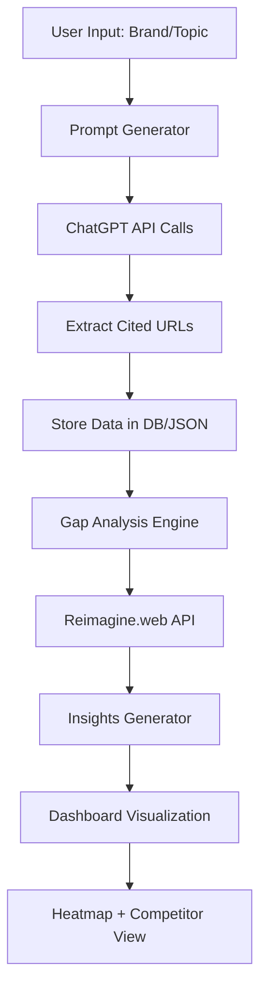

# 🌍 GEO Gap Compass — AI Visibility & Opportunity Tracker

🚀 **“Discover where your brand is missing in AI-generated answers — and how to fix it.”**

---

## 🧠 Overview

**GEO Gap Compass** is an AI-powered visibility analytics dashboard that helps brands understand how often (and where) they are cited by AI assistants such as ChatGPT.

The tool identifies **citation gaps** — topics or prompt categories where your brand should appear but doesn’t — and offers actionable insights using data from **Reimagine.web SEO metrics**.

> In short, it’s *Google Analytics for Generative AI* — showing not just who mentions you, but who doesn’t and why.

---

## 🏁 Hackathon Track

-**Track:** Intelligent GEO (Generative Engine Optimization) Insights

-**Category:** AI Search Visibility & SEO Intelligence

-**Duration:** 48 Hours

-**Goal:** Build an intelligent GEO insights tool using Reimagine.web and AI APIs.

---

## ✨ Key Features

### 🔍 1. Prompt Testing Lab

Input a brand or topic — the system auto-generates multiple prompt variations (e.g., “how-to,” “comparison,” “definition”) and tests them via ChatGPT.

Extracted citations are automatically logged and analyzed.

### 🔥 2. Citation Gap Heatmap

Visual heatmap showing which prompt types mention your brand and which don’t.

**Color-coded visibility:**

- 🟢 High — Frequently cited
- 🟡 Moderate — Occasionally cited
- 🔴 Low / Missing — Citation gap detected

### 🧩 3. Competitor Benchmarking

Add up to 3 competitors to compare citation frequencies and prompt performance side-by-side.

Identify which prompts trigger your competitors but skip your brand.

### 📈 4. Reimagine.web Integration

Fetch SEO/GEO scores of cited domains from Reimagine.web and compare them with your site.

Highlight areas where higher-ranked competitors gain visibility in AI responses.

### 💡 5. Actionable Insights

AI-generated, plain-language insights:

> “You’re missing citations in comparison and tutorial prompts.”

> “Your competitors appear 40% more often in how-to queries.”

### ⏱️ 6. (Optional) Time-Series Tracking

Track visibility trends over time (synthetic or real data).

See how citation frequency evolves after content or GEO optimizations.

---

## 🧰 Tech Stack

| Layer | Technology |

|-------|-------------|

| **Frontend** | Next.js + Tailwind CSS |

| **Backend** | FastAPI (Python) / Express.js (Node.js) |

| **AI APIs** | OpenAI API (GPT-4 / GPT-4o-mini) |

| **SEO/GEO Data** | Reimagine.web API |

| **Database** | SQLite / JSON storage |

| **Visualization** | Recharts (Heatmap, Trend Graphs) |

| **Deployment** | Vercel (frontend) + Railway / Render (backend) |

---

## 🧭 System Architecture



---

## ⚙️ Quick Setup

### 1️⃣ Clone the Repository

```bash

gitclone https://github.com/SanaAdeelKhan/geo-gap-compass.git

cd geo-gap-compass

```

### 2️⃣ Backend Setup

**Python (FastAPI)**

```bash

cd backend

pip install-requirements.txt

uvicornapp:app--reload

```

**or Node.js (Express)**

```bash

cdbackend

npminstall

npmstart

```

### 3️⃣ Frontend Setup

```bash

cdfrontend

npminstall

npmrundev

```

### 4️⃣ Environment Variables

Create a `.env` file in the backend directory:

```

OPENAI_API_KEY=your_openai_api_key

REIMAGINE_API_KEY=your_reimagine_api_key

```

### 5️⃣ Run the App

- Backend → http://localhost:8000
- Frontend → http://localhost:3000

---

## 📊 Example Output

### 🔸 Citation Gap Heatmap

| Prompt Type | Your Brand | Competitor A | Competitor B |

|--------------|-------------|---------------|---------------|

| How-To | 🟢 | 🟢 | 🟡 |

| Comparison | 🔴 | 🟢 | 🟢 |

| Informational | 🟡 | 🟢 | 🔴 |

| Problem Solving | 🔴 | 🟡 | 🟢 |

### 🔸 Insight Sample

🚨 *Your brand is underrepresented in “comparison” and “problem-solving” queries. Optimize content around these categories to improve AI visibility.*

---

## 🧩 Challenges Solved

- 🌐 Lack of visibility tracking across AI-generated answers
- 🧭 No existing metric for brand presence in Generative AI responses
- 📊 Difficulty comparing content GEO performance against competitors
- 💡 Turning unstructured AI outputs into actionable brand intelligence

---

## 🧠 Future Enhancements

- Multi-AI support (Claude, Perplexity, Gemini)
- Real-time citation monitoring with historical trends
- Automated content gap recommendations
- Team dashboard with exportable PDF reports

---

## 🎥 Demo Script (3-Minute)

1. Input brand name: “OpenAI”
2. Run auto-prompt tests → see citation results
3. Show heatmap: red zones = missing visibility
4. Add competitor → show comparison view
5. Show actionable insights panel
6. End with vision:

   > “GEO Gap Compass — helping brands win visibility in the age of AI search.”
   >

---

## 🏆 Why It Stands Out

✅ Tackles a brand-new problem — visibility in AI answers

✅ Combines prompt intelligence + GEO analytics

✅ Achievable in 48 hours yet visually impressive

✅ Perfectly aligned with Reimagine.web integration goals

✅ Balanced blend of innovation, technical skill, and real-world value

---

## 👥 Team

| Name | Role | Contribution |

|------|------|---------------|

| **Sana Adeel** | Product Lead | Concept, Design, Documentation |

| **Ali Jafar** | Dev Team | API Integration, Frontend, Demo |

---

## 🧾 License

MIT License © 2025 GEO Gap Compass Team
